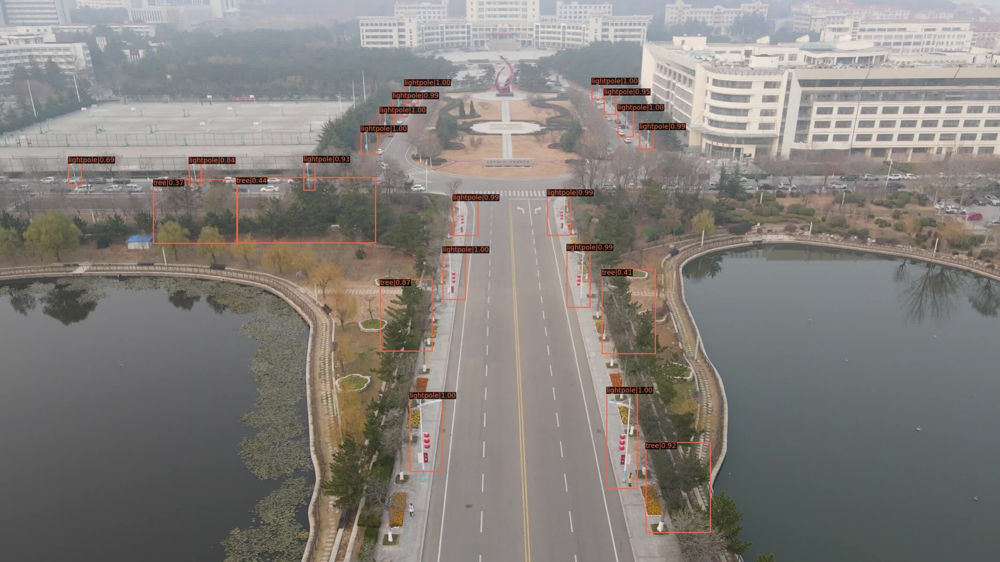
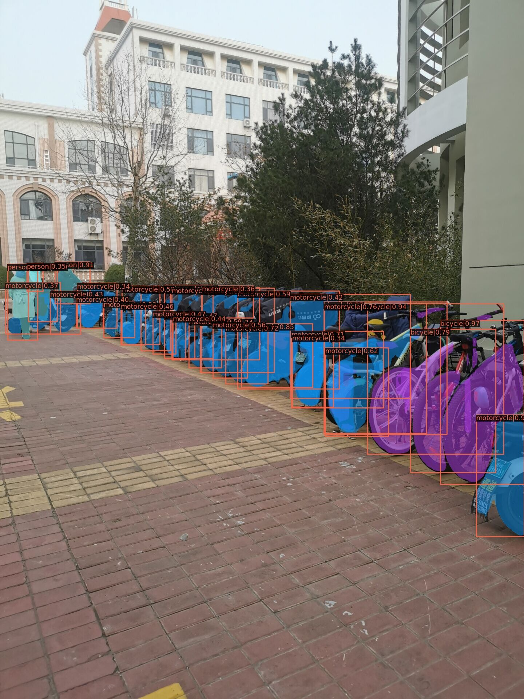

# Swin Transformer for Object Detection

This repo, forked from [Swin-Transformer-Object-Detection](https://github.com/SwinTransformer/Swin-Transformer-Object-Detection), contains the supported code and configuration files to reproduce object detection results of [Swin Transformer](https://arxiv.org/pdf/2103.14030.pdf). It is based on [mmdetection](https://github.com/open-mmlab/mmdetection).

## Reproduction

We wrote a elaborate instruction of reproduction in Chinese, which is named `目标检测与实例分割`. The English version of the instruction is under construction.

The fine-tuned checkpoint file and the config file is [here](https://pan.baidu.com/s/1L9K_miPxytL3vsju21GU9A ) (Code: 1glt ). 

## Result

**Light pole detection**

**Semantic segmentation**

**Object detection + Semantic segmentation**

